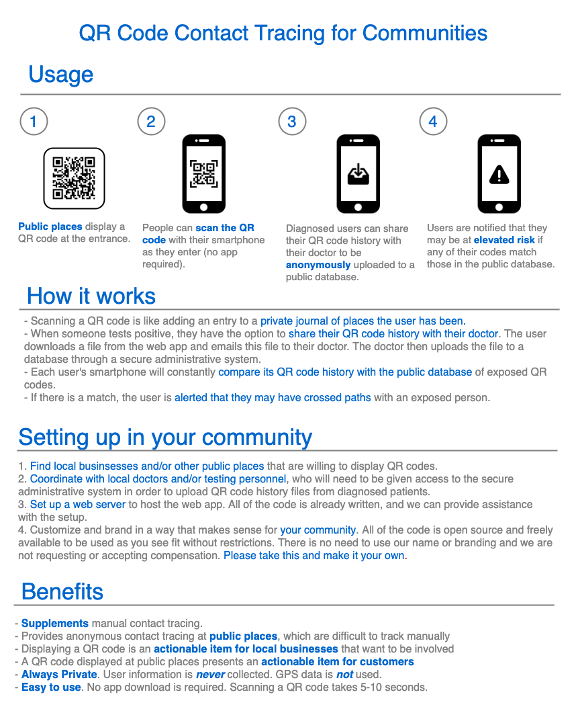

# TrackCOVID-community

An open source project which provides privacy-preserving contact tracing for communities using QR codes.

[Demo](https://demo.trackcovid.net/)

This is an open source project which is provided freely to communities which are interested in setting up digital contact tracing to supplement manual contact tracing in a way that is both easy to use and preserves privacy.

Here we present a strategy for setting up QR code-based contact tracing in your community or jurisdiction, with all of the source code necessary for this to happen. This approach can potentially add an additional layer of protection as public places begin reopening. Manual contact tracing in public places is very difficult, if not impossible in many cases. Our approach can help to notify people of potential exposure at these public places in a way that does not invade their privacy.

## Information packet

- [Download Packet](https://trackcovid.net/public/TrackCOVID-Information-Packet.zip)

## User flow diagram

## How to set up in your community

## FAQ

### 1. How do I download the app?

This is a "web app", rather than a native app. That means it's just a website you can view on your phone. So, there is nothing to download. You can see a demo at https://demo.trackcovid.net.

### 2. Where is the data stored?

When a user scans a checkpoint on their phone, the data is stored *only on that phone* (for curious techies, it is stored in the browser's [local storage](https://developer.mozilla.org/en-US/docs/Web/API/Window/localStorage)). When a COVID-positive patient downloads their checkpoint history file and shares this with their doctor, the data will be uploaded to an online database and stored there.

### 3. How long is the data stored?

When setting up the project, whoever is in charge of the project will need to decide *how far back in time to notify people of potential exposures*. For example, in the demo app, this is set to 7 days. All checkpoints that are older than this amount of time are considered "expired". Expired checkpoints are continuously deleted, both from users' phones and from the online database.

### 4. What is in the checkpoint history file?

The checkpoint history file is just a list of checkpoints (random sequences of letters and numbers), each with an associated timestamp. It contains all checkpoints that the user has scanned up to a certain point in the past (the amount of time which has been configured as described in Q #3, e.g. 7 days in the demo app). It contains no data about the user.

### 5. How are users notified of potential exposure?

Users must check their status through the web app. If a potential exposure has been found, an alert will be displayed prominently at the top of the screen. Users may open the web app at any time to check their status, and they will also see their status the next time they go to a public place and scan a QR code.

## Server setup instructions

[See detailed instructions here.](SETUP.md)
